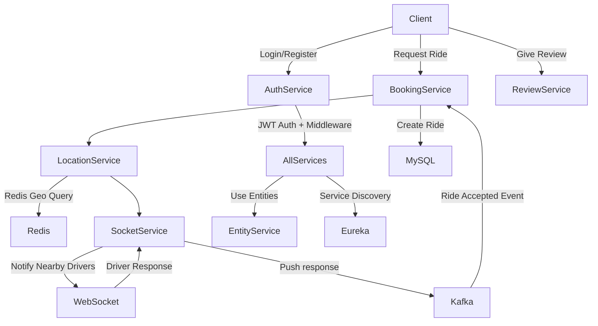

# 🚗 Uber Backend Clone - Microservices Architecture

A complete backend system mimicking the core functionality of Uber, built using Spring Boot and Microservices architecture. The system is designed to be modular, scalable, and production-grade, featuring real-time communication, location-based services, and asynchronous messaging.

---

## 🔍 Overview

This project aims to provide a ride-booking backend platform with the following features:

* Real-time communication with drivers.
* JWT-based authentication and role-based access control.
* Geolocation-based driver matching using Redis.
* Asynchronous event communication with Kafka.
* Microservices-based modular architecture.

---

## 🚀 Architecture Diagram (Flowchart)



---

## 🎓 Microservices Breakdown

### 🔐 AuthService

* **Responsibilities:**

    * User registration.
    * JWT-based authentication and authorization.
    * Middleware to validate requests.
* **Tech Stack:** Spring Security, JWT, Spring Boot.

### ⭐ ReviewService

* **Responsibilities:**

    * Collects ratings/reviews from passengers and drivers.
    * Provides historical review data for users.
* **Tech Stack:** Spring Boot, MySQL.

### 🌍 LocationService

* **Responsibilities:**

    * Tracks driver/passenger locations.
    * Communicates with Redis for storing and querying geolocation data.
* **Tech Stack:** Spring Boot, Redis, GeoSpatial Queries.

### 💬 SocketService

* **Responsibilities:**

    * Maintains WebSocket connection with drivers.
    * Sends ride requests to nearby drivers.
    * Publishes accepted rides to Kafka.
* **Tech Stack:** Spring Boot, WebSocket, Kafka.

### 🚖 BookingService

* **Responsibilities:**

    * Handles booking requests.
    * Coordinates with LocationService and SocketService.
    * Listens to Kafka topic for driver acceptance.
    * Persists booking data.
* **Tech Stack:** Spring Boot, Kafka, Redis, MySQL.

### 🏃 EntityService

* **Responsibilities:**

    * Shared Maven module for all entity classes.
    * Ensures consistency across all services.
    * Uses Flyway for DB migrations.
* **Tech Stack:** Spring Boot, JPA, Flyway.

### 📎 Service Registry (Eureka)

* **Responsibilities:**

    * Registers all microservices.
    * Facilitates service discovery.
* **Tech Stack:** Spring Cloud Netflix Eureka.

---

## 📄 Technologies Used

* **Spring Boot** for creating REST APIs.
* **Spring Security** + **JWT** for authentication and authorization.
* **Spring Data JPA** with **MySQL** for persistence.
* **Redis** with Geo queries for geolocation.
* **Kafka** for asynchronous communication.
* **Flyway** for versioned database migrations.
* **Retrofit** for inter-service communication.
* **Eureka Server** for service registration and discovery.

---

## 💡 Key Features

* Modularized microservices architecture for scalability.
* Real-time communication via WebSocket.
* Event-driven flow using Kafka.
* Efficient nearest-driver fetching using Redis Geo queries.
* Centralized entity and schema management.

---

## 🛋‍♂️ How Booking Works

1. **Client** sends ride request to `BookingService`.
2. `BookingService` calls `LocationService` to get nearby drivers.
3. `LocationService` queries Redis using `GEORADIUS`.
4. Driver list passed to `SocketService`, which notifies drivers via WebSocket.
5. Drivers respond (accept/reject); response is published to Kafka.
6. `BookingService` listens to Kafka topic and creates a ride on acceptance.

---

## 📁 Folder Structure

```
uber-backend/
│
├── auth-service/
├── review-service/
├── location-service/
├── socket-service/
├── booking-service/
├── entity-service/
├── eureka-server/
├── docker-compose.yml (Optional if containerized)
└── README.md
```

---

## 💪 Challenges Faced

* Managing distributed authentication.
* Handling real-time communication reliably.
* Coordinating between services without tight coupling.
* Maintaining consistent database schema across microservices.

---

## 🙌 What I Learned

* Deep understanding of **Spring Security and JWT**.
* Working with **WebSockets** in a multi-client environment.
* Integrating **Kafka** for reliable pub/sub communication.
* Efficient usage of **Redis Geo queries**.
* Microservices orchestration and **service discovery with Eureka**.

---

## 🚜 Future Improvements

* Add ride cancellation flow.
* Integrate payment gateway microservice.
* Add Prometheus + Grafana for observability.
* Use Circuit Breaker with Resilience4j for fault-tolerance.

---

## 📍 Run Locally

Each service has its own README and `application.properties`. You can start each service with:

```bash
./mvnw spring-boot:run
```

Or use Docker Compose to start all services (recommended if you containerize everything).

---

## 🌟 Author

**Hrishabh Joshi**
Backend Developer | Java & Spring Enthusiast
[GitHub](https://github.com/) | [LinkedIn](https://linkedin.com/)

---

Feel free to fork, raise issues, or suggest features!
